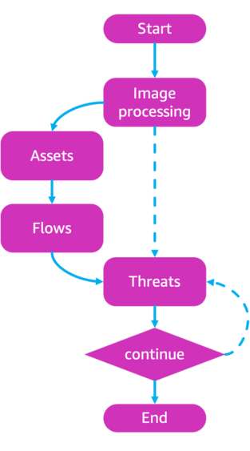

<p align="center">
  
</p>

# Threat Designer: AI-powered threat modeling for secure system design

### Architecture diagram


### Agent logic

<p align="center">
  
</p>

### Description

Threat Designer is an AI-driven agent designed to automate and streamline the threat modeling process for secure system design.

Harnessing the power of large language models (LLMs), it analyzes system architectures, identifies potential security threats, and generates detailed threat models. By automating this complex and time-intensive task, Threat Designer empowers developers and security professionals to seamlessly incorporate security considerations from the earliest stages of development, enhancing both efficiency and system resilience.

The project deploys resources running on the following AWS services:

- AWS Amplify
- Amazon API Gateway
- Amazon Cognito
- AWS Lambda
- Amazon DynamodB Tables
- Amazon S3 Bucket

## Repository Structure

```
.
├── CODE_OF_CONDUCT.md
├── CONTRIBUTING.md
├── LICENSE
├── README.md
├── assets
├── backend
│   ├── app
│   ├── authorizer
│   ├── dependencies
│   └── threat_designer
├── deployment.sh
├── destroy.sh
├── index.html
├── infra
├── package.json
├── public
├── src
└── vite.config.js
```

## Features

- Submit architecture diagrams and analyze for threats.
- Update threat modeling results via the user interface.
- Replay threat modeling based on your edits and additional input.
- Export results in pdf/docx format.
- Explore past threat models via the `Threat Catalog` page.


## Prerequisites

The following tools must be installed on your local machine:

- [Node.js](https://nodejs.org/en/download) (v18 or later) and npm
- [curl](https://curl.se/)
- [jq](https://jqlang.org/download/)
- [Python](https://www.python.org/downloads/) (v3.12 or later) and pip
- [Terraform CLI](https://developer.hashicorp.com/terraform/install)
- [AWS CLI](https://docs.aws.amazon.com/cli/v1/userguide/cli-chap-install.html) configured with [appropriate credentials](https://docs.aws.amazon.com/cli/v1/userguide/cli-chap-configure.html)

### AWS Bedrock Model Access

You must enable access to the following model in your AWS region:

- **Claude 3.7 Sonnet**

To enable Claude, follow the instructions [here](https://docs.aws.amazon.com/bedrock/latest/userguide/model-access-modify.html).

## Installation and Deployment

1. Clone the Repository

```bash
git clone https://github.com/awslabs/threat-designer.git
cd threat-designer
```

2. Make the deployment script executable:

```bash
chmod +x deployment.sh
```

3. Export AWS credentials

```bash
# Option I: Export AWS temporary credentials
export AWS_ACCESS_KEY_ID="your_temp_access_key"
export AWS_SECRET_ACCESS_KEY="your_temp_secret_key"
export AWS_SESSION_TOKEN="your_temp_session_token"
export AWS_DEFAULT_REGION="your_region"

# Option II: Export AWS Profile
export AWS_PROFILE="your_profile_name"
```

4. Deploy with required parameters:

> **Note:** Make sure to provide a valid email address during the deployment wizard. A user in Amazon Cognito User Pool will be created and the temporary credentials will be sent to the configured email address.

```bash
./deployment.sh
```

## Accessing the Application

After successful deployment, you can find the Login URL in the output of `./deployment`:

```sh
Application Login page: https://dev.xxxxxxxxxxxxxxxx.amplifyapp.com
```

## Configuration Options

### Model Selection

If you want to use a different model than "Claude 3.7 Sonnet", update the variables **model_main** and **model_struct** in `./infra/variables.tf` with the correct [model ID](https://docs.aws.amazon.com/bedrock/latest/userguide/model-ids.html#model-ids-arns) and max_token configuration:

```hcl
variable "model_main" {
  type = object({
    id          = string
    max_tokens  = number
  })
  default = {
    id          = "us.anthropic.claude-3-7-sonnet-20250219-v1:0"
    max_tokens  = 64000
  }
}

variable "model_struct" {
  type = object({
    id          = string
    max_tokens  = number
  })
  default = {
    id          = "us.anthropic.claude-3-7-sonnet-20250219-v1:0"
    max_tokens  = 16000
  }
}
```

> **Note:** This application has been primarily tested with "Claude 3.7 Sonnet". While other Bedrock models may work, using different models might lead to unexpected results. The default model is set to **us.anthropic.claude-3-7-sonnet-20250219-v1:0**.

> **Reasoning boost** will only work with **us.anthropic.claude-3-7-sonnet-20250219-v1:0**

## Clean up

1. Empty the **Architecture Bucket**, following instructions [here](https://docs.aws.amazon.com/AmazonS3/latest/userguide/empty-bucket.html)

2. Make the destroy script executable:

```bash
chmod +x destroy.sh
```

3. Export AWS credentials

```bash
# Option I: Export AWS temporary credentials
export AWS_ACCESS_KEY_ID="your_temp_access_key"
export AWS_SECRET_ACCESS_KEY="your_temp_secret_key"
export AWS_SESSION_TOKEN="your_temp_session_token"
export AWS_DEFAULT_REGION="your_region"

# Option II: Export AWS Profile
export AWS_PROFILE="your_profile_name"

```

4. Execute the script:

```bash
./destroy.sh
```

## Contributing

See [CONTRIBUTING](CONTRIBUTING.md#security-issue-notifications) for more information.

## License

This library is licensed under the Apache License. See the [LICENSE](LICENSE) file.
